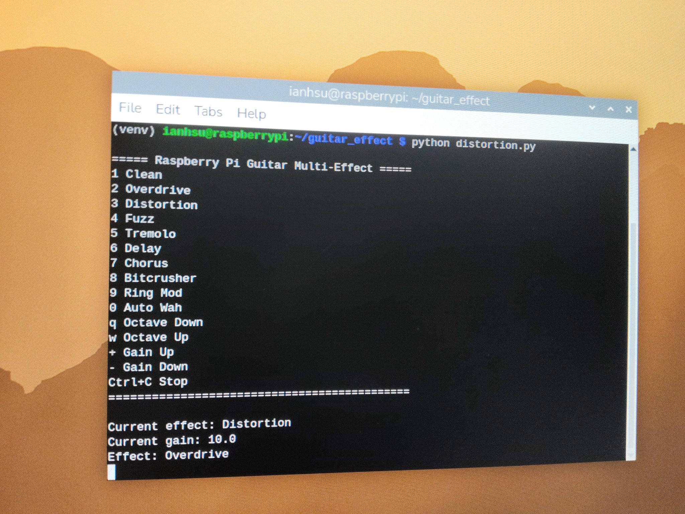
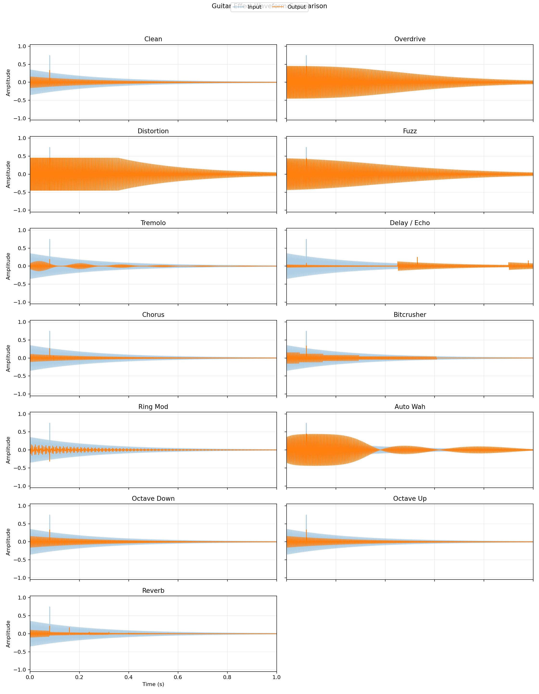

# 基於 Raspberry Pi 的即時吉他多音效處理器

本專題使用 Raspberry Pi 與 Behringer U-PHORIA UM2 USB 音訊介面，實作一套即時電吉他多音效處理器。

系統會透過 UM2 接收吉他輸入訊號，再由 Python 程式進行即時數位音訊處理，最後將處理後的聲音輸出到 UM2 的耳機輸出端。

## 專題動機

傳統吉他綜合效果器與單顆效果器價格較高，若要組成完整音色系統，通常需要破音、Delay、Modulation、錄音介面與音箱模擬等多種設備，整體成本會明顯提高。因此，本專題希望以 Raspberry Pi 作為嵌入式 Linux 處理平台，搭配 Behringer UM2 USB 音訊介面，建立一套低成本、可自由擴充的吉他效果器系統。

本專題的核心目標是將嵌入式系統、Linux 音訊輸入輸出、USB Audio Interface 與數位訊號處理整合成一個實際可操作的音樂應用。相較於固定功能的商用硬體，本系統可以透過修改程式加入新的音效、調整參數，未來也能延伸加入腳踏開關、LED 顯示與旋鈕控制。

## 成果預覽



上圖為 Raspberry Pi 終端機執行吉他多音效程式的畫面。終端機會顯示可用音效模式、目前音效、目前 gain 值，以及即時音效切換結果。圖中程式已在 Raspberry Pi 上成功執行，並將音效切換為 Overdrive。

## 硬體需求

- Raspberry Pi
- Behringer U-PHORIA UM2 USB 音訊介面
- 電吉他
- 6.3 mm 吉他導線
- 耳機或主動式喇叭

建議接線方式：

```text
電吉他
  -> UM2 INST 2 input
  -> USB to Raspberry Pi
  -> Python real-time DSP
  -> UM2 headphone output
  -> 耳機 / 喇叭
```

UM2 使用注意事項：

- 電吉他建議接到 `INST 2`。
- 測試處理後音效時，建議關閉 `DIRECT MONITOR`。
- 電吉他不需要開啟 `+48V` phantom power。
- `INST 2 GAIN` 與 `OUTPUT` 建議先從小音量開始，再慢慢增加。

## 音效功能

目前鍵盤控制如下：

| 按鍵 | 音效 |
| --- | --- |
| `1` | Clean |
| `2` | Overdrive |
| `3` | Distortion |
| `4` | Fuzz |
| `5` | Tremolo |
| `6` | Delay / Echo |
| `7` | Chorus |
| `8` | Bitcrusher |
| `9` | Ring Mod |
| `0` | Auto Wah |
| `q` | Octave Down |
| `w` | Octave Up |
| `+` | Gain Up |
| `-` | Gain Down |

## 波形分析



不同音效會以不同方式改變輸入波形。Overdrive 與 Distortion 透過增益放大與 clipping 改變波形形狀；Delay 與 Reverb 透過 buffer 將過去的聲音重新混入輸出；Tremolo、Ring Mod 與 Auto Wah 則使用低頻振盪器產生週期性變化。

更完整的公式與個別波形圖可參考 [docs/effect_formulas_waveforms.md](docs/effect_formulas_waveforms.md)。

## 安裝方式

安裝 Python 套件：

```bash
pip install -r requirements.txt
```

在 Raspberry Pi 上確認音訊裝置：

```bash
python -m sounddevice
```

如果 UM2 在 Raspberry Pi 上的裝置編號不同，請修改 `src/distortion.py` 中這行：

```python
sd.default.device = (2, 2)
```

第一個數字代表輸入裝置編號，第二個數字代表輸出裝置編號。

## 執行方式

```bash
python src/distortion.py
```

Demo 時建議切換順序：

```text
1 Clean -> 2 Overdrive -> 3 Distortion -> 4 Fuzz -> 6 Delay -> 5 Tremolo -> 0 Auto Wah
```

測試 Delay 時，建議彈一個短音後停住，這樣比較容易聽到回音。

## 專案結構

```text
rpi-guitar-effects/
+-- README.md
+-- requirements.txt
+-- src/
|   +-- distortion.py
+-- hardware/
|   +-- wiring.md
+-- docs/
|   +-- project_notes.md
|   +-- research_flow.md
|   +-- reverb_explanation.md
|   +-- experimental_results.md
|   +-- effect_formulas_waveforms.md
+-- scripts/
|   +-- plot_reverb_waveform.py
|   +-- plot_effect_waveforms.py
+-- demo/
|   +-- README.md
+-- images/
    +-- README.md
```

## 技術重點

- Raspberry Pi Embedded Linux
- USB audio interface 整合
- 使用 `sounddevice` 進行即時音訊串流
- 使用 `numpy` 進行數位訊號處理
- Distortion、clipping、delay buffer、tremolo 與 modulation 音效實作
- 透過 sampling rate 與 block size 調整低延遲音訊處理
- 各音效公式與波形分析

## 遇到的困難與解決方式

| 遇到的問題 | 解決方式 |
| --- | --- |
| USB 音訊裝置編號可能在不同系統中改變 | 使用 `python -m sounddevice` 查詢目前可用音訊裝置，並更新程式中的 `sd.default.device`。 |
| 吉他輸入可能只出現在單邊聲道 | 使用 `np.mean(indata, axis=1)` 將輸入混成 mono，再將處理後聲音複製到左右聲道輸出。 |
| Distortion 與 Fuzz 容易造成爆音或 clipping | 使用 `np.clip(y, -1.0, 1.0)` 限制最終輸出範圍，避免訊號超過有效音訊區間。 |
| Delay 一開始聽起來不明顯 | 調高 `delay_time`、`delay_feedback` 與 `delay_mix`，讓回音時間、回授量與效果比例更明顯。 |
| 降低 latency 會增加 Raspberry Pi 運算負擔 | 調整 `blocksize` 取得平衡。較小的 blocksize 可降低延遲，較大的 blocksize 則能提高穩定性。 |

這些問題也影響了最後的系統設計。最終版本已能正確處理左右耳輸出、讓 Delay 效果更明顯、避免過度 clipping，並讓音訊串流在 Raspberry Pi 上保持可用的即時穩定性。

## 未來改進方向

- 加入 GPIO 腳踏開關控制 bypass
- 加入 LED 顯示目前效果狀態
- 加入 ADC 旋鈕控制 gain、volume 與 tone
- 改善 Chorus，使用 LFO 調變 delay time
- 加入 tone filter 與 noise gate
- 錄製 demo 影片與音訊範例
