# Effect Formulas and Waveform Analysis

This section explains the formulas used by each guitar effect and provides waveform figures for the experiment report. In the formulas, `x[n]` means the input guitar signal, `y[n]` means the processed output signal, `g` means gain, `D` means delay samples, and `m` means mix ratio.

## Waveform Comparison


Figure 1 shows the waveform comparison of all effects using the same test input signal. The light signal is the original input, and the darker signal is the processed output.

## Clean

Formula:

```text
y[n] = x[n]
```

Clean mode does not change the input waveform. It is used as the reference sound for comparing other effects.

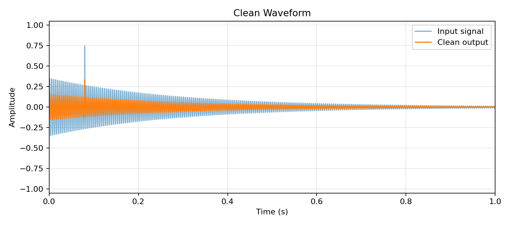

## Overdrive

Formula:

```text
y[n] = tanh(g * x[n])
```

Overdrive first increases the input signal by gain `g`, then uses `tanh()` to compress the waveform smoothly. Because the top and bottom of the waveform are rounded instead of sharply cut, the sound is warmer and less aggressive than hard distortion.

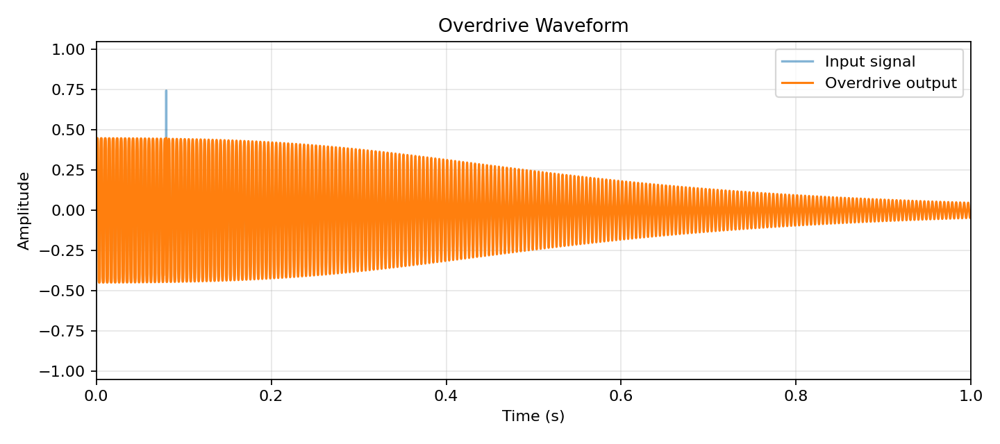

## Distortion

Formula:

```text
y[n] = clip(g * x[n], -1, 1)
```

Distortion increases the signal and then limits it between `-1` and `1`. When the signal is too large, the waveform is directly clipped, creating a stronger and harder distorted sound.

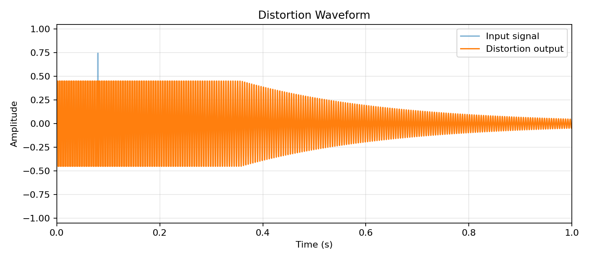

## Fuzz

Formula:

```text
z[n] = g * x[n]
y[n] = sign(z[n]) * (1 - exp(-abs(z[n])))
```

Fuzz uses a stronger nonlinear transformation. The waveform becomes heavily compressed and saturated, so the sound is rougher and more aggressive than overdrive and distortion.

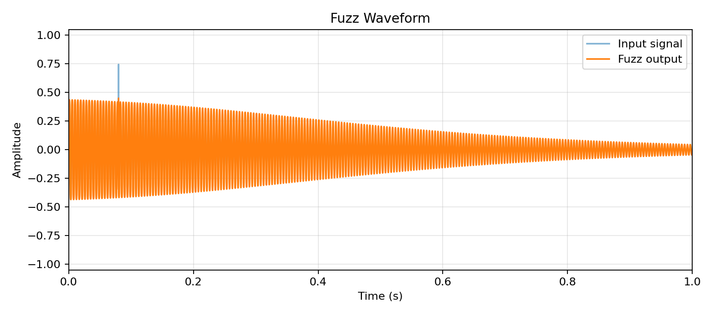

## Tremolo

Formula:

```text
LFO[n] = 0.5 + 0.5 * sin(2*pi*f*t[n])
y[n] = x[n] * LFO[n]
```

Tremolo changes the volume periodically. In this project, the low-frequency oscillator uses about `6 Hz`, so the guitar volume repeatedly becomes louder and quieter.

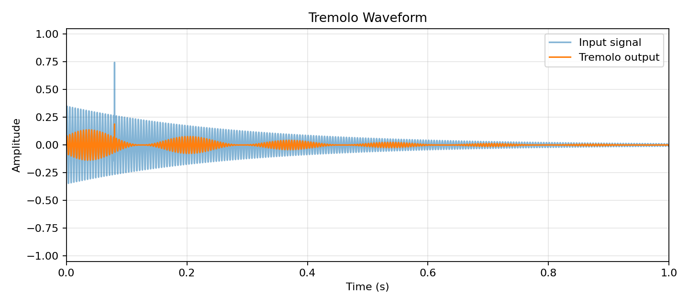

## Delay / Echo

Formula:

```text
y[n] = (1 - m) * x[n] + m * d[n - D]
d[n] = x[n] + feedback * d[n - D]
```

Delay stores past audio samples in a circular buffer and plays them back after a delay time. The `feedback` value writes part of the delayed sound back into the buffer, creating repeated echoes.

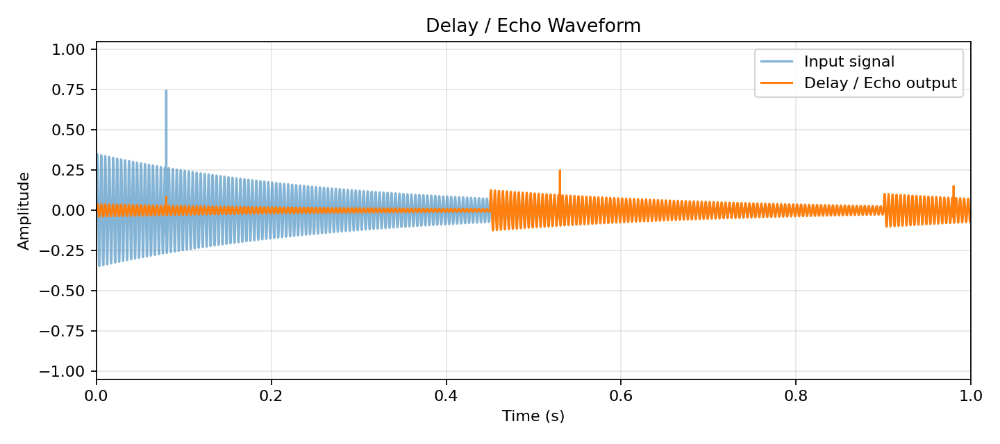

## Chorus

Formula:

```text
y[n] = (x[n] + 0.45 * x[n - D]) / 1.45
```

Chorus mixes the original signal with a short delayed copy. Because the delayed signal is close to the original, the sound becomes thicker, similar to multiple instruments playing together.

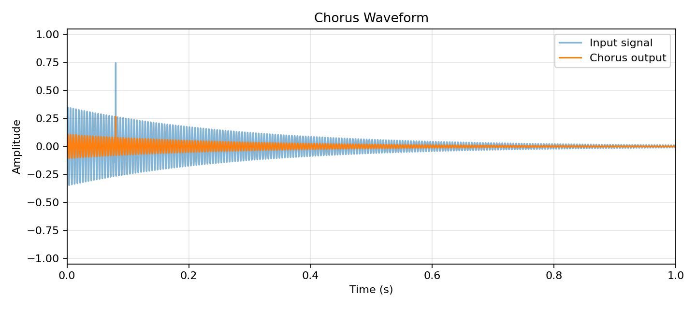

## Bitcrusher

Formula:

```text
y[n] = round(12 * x[n]) / 12
```

Bitcrusher reduces the resolution of the audio amplitude. The waveform becomes stair-stepped instead of smooth, creating a digital and rough sound.


## Ring Mod

Formula:

```text
c[n] = sin(2*pi*f_c*t[n])
y[n] = x[n] * c[n]
```

Ring modulation multiplies the guitar signal by another sine wave called the carrier. This changes the frequency content and creates a metallic or robotic sound.

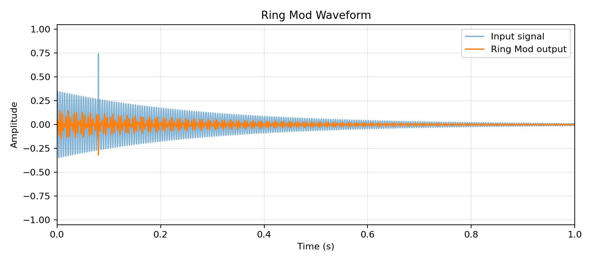

## Auto Wah

Formula:

```text
w[n] = 0.3 + 0.7 * sin(2*pi*f_w*t[n])
y[n] = tanh(g * x[n] * w[n])
```

Auto Wah uses a low-frequency oscillator to change the strength of the processed signal over time. In this simplified version, the wah value controls the distortion amount periodically, creating a moving tone effect.

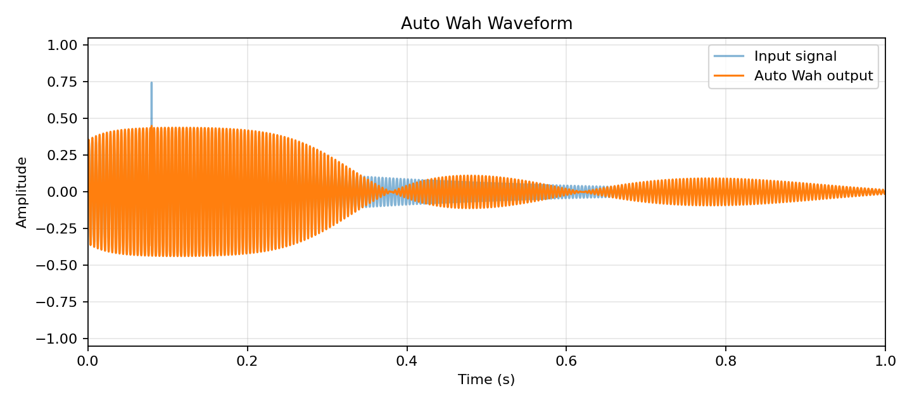

## Octave Down

Formula:

```text
y[2k] = x[2k]
y[2k + 1] = x[2k]
```

The simple octave-down effect repeats samples so that the waveform changes more slowly. This creates a lower-pitched feeling, although it is a simplified implementation rather than a professional pitch-shifting algorithm.

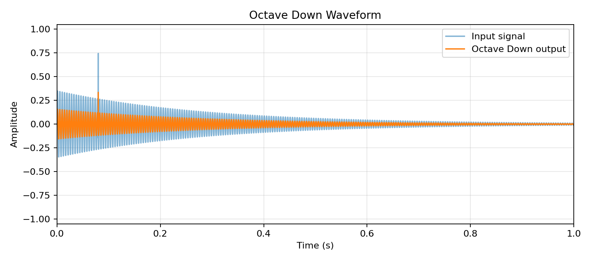

## Octave Up

Formula:

```text
y[n] = abs(x[n]) * sign(x[n])
```

This simplified octave-up implementation keeps the sign of the original waveform and uses the absolute value operation. It changes the harmonic content and produces a brighter sound. For a more realistic octave-up effect, a dedicated pitch-shifting algorithm can be used in future work.

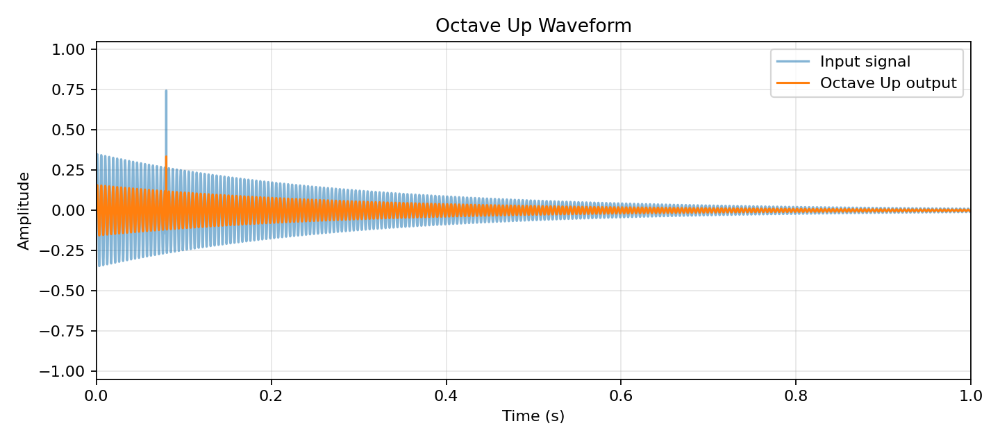

## Reverb

Simplified formula:

```text
y[n] = x[n] + sum(k=1..K) a_k * x[n - D_k]
```

Buffer implementation:

```text
y[n] = (1 - m) * x[n] + m * r[n - D]
r[n] = x[n] + feedback * r[n - D]
```

Reverb simulates many short reflections in a room. Compared with delay, reverb uses shorter and denser reflections, so the result sounds like a spatial tail instead of one obvious echo.

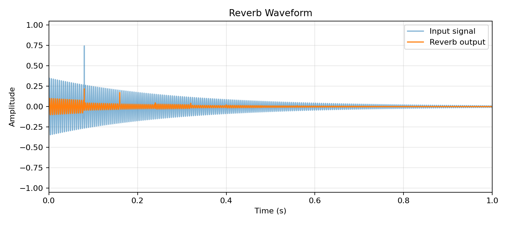

## Suggested Report Text

本專題將吉他輸入訊號視為離散時間訊號 `x[n]`，並透過不同數位訊號處理公式產生各種音效。Clean 模式不改變原始波形；Overdrive 與 Distortion 透過增益放大與 clipping 改變波形形狀；Delay 與 Reverb 則利用 buffer 儲存過去的聲音，再將延遲訊號與目前訊號混合輸出；Tremolo、Ring Mod 與 Auto Wah 使用低頻振盪器改變音量或訊號強度；Bitcrusher 透過量化降低振幅解析度；Octave 類效果則透過簡化的取樣操作改變音高感。由波形圖可觀察到，不同音效會對原始訊號造成不同型態的改變，因此能產生不同的吉他音色。
